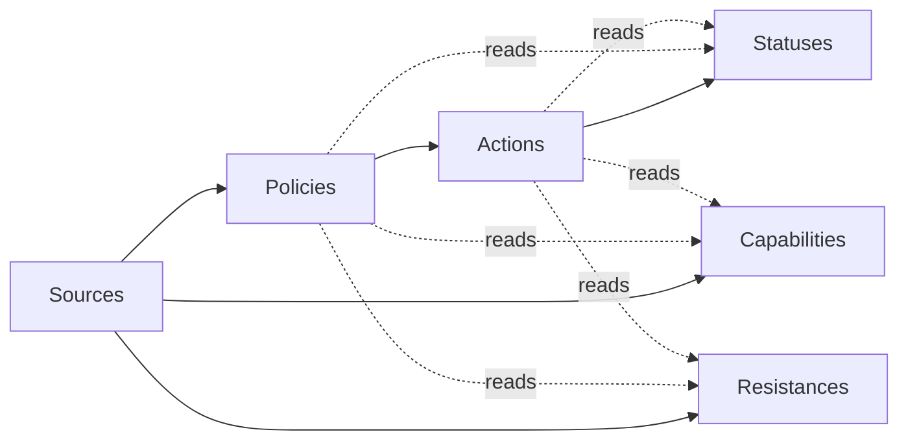

# Gameplay Architecture V2

> Date: 2026-08-03
> Status: Authoritative design reference
> Scope: Final gameplay-definition architecture for IronHell
>
> This document defines the authoritative gameplay-definition architecture that all future gameplay schemas, validation rules, and JSON content must follow.
>
> This document does not define schemas, JSON formats, migrations, or implementation code.

---

## 1. Purpose

IronHell needs a gameplay-definition architecture that preserves verified MAngband semantics while remaining deterministic, data-driven, and maintainable.

The completed research establishes that the correct architecture is:

```text
Sources -> Policies -> Actions -> Statuses
                 \-> Capabilities
                 \-> Resistances
```

This is the authoritative design model.

Future gameplay-definition work must treat:
- Sources as origin definitions
- Policies as source-specific gating and execution rules
- Actions as reusable payload definitions
- Statuses as temporary mutable state
- Capabilities as persistent or passive gameplay properties
- Resistances as typed mitigation and protection semantics

If a future schema or content proposal conflicts with this model, this document takes precedence.

---

## 2. Authoritative Inputs

This design is derived from the completed research set:

- [docs/CANONICAL_GAMEPLAY_MODEL_RESEARCH.md](docs/CANONICAL_GAMEPLAY_MODEL_RESEARCH.md)
- [docs/CAPABILITY_SCOPE_MATRIX.md](docs/CAPABILITY_SCOPE_MATRIX.md)
- [docs/RESISTANCE_MODEL_ANALYSIS.md](docs/RESISTANCE_MODEL_ANALYSIS.md)
- [docs/MONSTER_ACTION_PROJECTION.md](docs/MONSTER_ACTION_PROJECTION.md)
- [docs/DEVICE_SEMANTICS_ANALYSIS.md](docs/DEVICE_SEMANTICS_ANALYSIS.md)
- [docs/TRAP_ARCHITECTURE_RESEARCH.md](docs/TRAP_ARCHITECTURE_RESEARCH.md)
- [docs/ACTION_CANDIDATE_CATALOG.md](docs/ACTION_CANDIDATE_CATALOG.md)
- [docs/FINAL_ARCHITECTURE_READINESS_REPORT.md](docs/FINAL_ARCHITECTURE_READINESS_REPORT.md)

These documents are authoritative evidence. This document is the authoritative design conclusion drawn from them.

---

## 3. Core Design Rules

1. Payload reuse happens at the Action layer, not at the Source layer.
2. Source-specific behavior remains in Policy, not in Actions.
3. Temporary state remains in Statuses, not in Capabilities.
4. Passive identity and equipment traits remain in Capabilities, not in Statuses.
5. Typed mitigation and protection semantics remain in Resistances, not in generic capabilities or action metadata.
6. Monster AI, device economies, spell lifecycle, and trap trigger logic are Policy concerns.
7. Reusable gameplay outcomes such as damage, healing, teleportation, summoning, detection, and status application are Action concerns.
8. Validation must reject any model that collapses distinct parity-proven semantics into one flattened channel.

---

## 4. Layer Model



### 4.1 Sources

**Purpose**

Sources define where gameplay comes from.

Examples include:
- spells
- prayers
- monster blows
- monster spells
- rods
- wands
- staves
- potions
- scrolls
- food and other consumables
- activations
- floor traps
- chest traps
- race-native traits
- class-native traits
- equipment passive grants

**Responsibilities**

Sources own:
- stable identity
- source family classification
- authoring-time definition of what kind of thing the source is
- references to one or more Policies when execution is conditional or gated
- references to one or more Actions when the source produces reusable payload outcomes
- references to Capabilities or Resistances when the source passively grants them

Sources do not own reusable payload semantics. They choose and organize them.

**Allowed relationships**

Sources may:
- reference Policies
- reference Actions
- grant Capabilities
- grant Resistances

Sources must not:
- define reusable payload logic inline as source-exclusive behavior when that payload is already canonical at the Action layer
- embed temporary status runtime state
- flatten Policy into Action parameters
- flatten Capabilities or Resistances into display metadata

**Validation requirements**

Validation for Sources must ensure:
- every source has a stable unique identity within its source family
- every referenced Policy exists and is legal for that source family
- every referenced Action exists and is legal for that source family
- passive grants target either Capabilities or Resistances explicitly
- a source cannot directly encode temporary state as if it were permanent state
- source definitions cannot bypass layer boundaries by embedding source-only trigger or economy logic into Actions

### 4.2 Policies

**Purpose**

Policies define when, whether, and how a Source is allowed to invoke Actions or grant outcomes.

Policy is the control layer between source identity and payload execution.

**Responsibilities**

Policies own:
- legality checks
- trigger conditions
- target acquisition rules
- source-specific resource rules
- availability and cooldown rules
- sequencing and selection rules
- smart filtering and preference rules
- world-context gating
- source-specific failure behavior

Examples proven by research include:
- spell level, mana, failure, and lifecycle rules
- monster AI frequency, line-of-sight, legality, and smart-casting filters
- rod timeout availability
- wand and staff charge economy
- recharge backfire rules
- trap discovery, trigger, and chest-open or disarm activation rules

**Allowed relationships**

Policies may:
- read Source metadata
- read actor state
- read target state
- read world state
- read Capabilities
- read Resistances
- read Statuses
- select, suppress, parameterize, or sequence Actions

Policies must not:
- become reusable payload catalogs
- redefine the same payload semantics separately per source family
- store long-lived actor identity
- masquerade as Statuses

**Validation requirements**

Validation for Policies must ensure:
- each Policy is explicitly scoped to allowed source families
- all inputs read by the Policy are declared and semantically valid
- Policy behavior is control-oriented, not payload-oriented
- source-specific economies remain in Policy and cannot be modeled as generic action arguments
- monster AI rules, trap triggers, and device economies are not misfiled into Actions
- Policy definitions cannot introduce duplicate payload vocabularies

### 4.3 Actions

**Purpose**

Actions define reusable gameplay payloads.

They are the shared execution vocabulary that multiple source families may invoke.

**Responsibilities**

Actions own:
- the semantic meaning of a gameplay payload
- the typed parameters required to execute that payload
- the allowed runtime outcomes produced by that payload
- interaction with Statuses, Capabilities, and Resistances during resolution

Examples include:
- damage payloads
- healing payloads
- status application and curing
- teleportation
- summoning
- detection
- identification
- mapping and lighting
- terrain alteration
- equipment enchantment

**Allowed relationships**

Actions may:
- be referenced by many Sources
- be invoked through many Policies
- apply, remove, or mutate Statuses
- consult Capabilities
- consult Resistances
- consult existing Statuses
- mutate world state when the payload itself is canonical and proven reusable

Actions must not:
- encode monster spell-selection intelligence
- encode rod, wand, or staff resource models
- encode spell learning or failure lifecycle
- encode trap trigger or chest lifecycle rules
- encode source identity

**Validation requirements**

Validation for Actions must ensure:
- every Action has one canonical semantic definition
- Action names represent payloads, not source-specific behaviors
- all parameters are payload parameters, not hidden Policy parameters
- any Action reused by multiple source families keeps one shared meaning across those families
- Actions that are not parity-proven must not enter the canonical catalog
- world-mutation actions with unresolved policy coupling must remain explicitly constrained or excluded

### 4.4 Statuses

**Purpose**

Statuses define temporary mutable gameplay state.

A Status exists on an actor, target, or runtime entity for some duration and changes behavior while active.

**Responsibilities**

Statuses own:
- temporary state identity
- duration and decay semantics
- temporary behavioral effects while active
- stacking or refresh rules
- removal and expiration behavior

Examples include:
- haste
- slow
- confusion
- blindness
- fear
- paralysis
- elemental oppose timers
- protection-style timed states

**Allowed relationships**

Statuses may:
- be applied or removed by Actions
- be read by Policies
- be read by Actions
- contribute temporary modifiers to gameplay resolution

Statuses must not:
- represent permanent racial or class identity
- replace item-self protections
- replace permanent passive traits
- absorb full resistance semantics into one undifferentiated timer model

**Validation requirements**

Validation for Statuses must ensure:
- each Status is explicitly temporary
- duration and decay semantics are defined
- refresh, replacement, or stacking behavior is defined
- timed elemental oppose remains distinct from permanent resistance and immunity
- a Status cannot be used to express native identity or item-self passive protection

### 4.5 Capabilities

**Purpose**

Capabilities define persistent or passive gameplay properties that are not temporary runtime statuses.

Capabilities are not a single flat bucket. Research proves that scope is behaviorally real.

**Responsibilities**

Capabilities own:
- native identity traits from race or class
- bearer passive traits granted by equipment or other persistent sources
- item-self passive properties that protect the item itself
- offensive or utility passive traits that modify behavior without being timed states

Capability scope must remain explicit.

The minimum parity-safe scope split is:
- native identity
- bearer passive
- item self passive

**Allowed relationships**

Capabilities may:
- be granted by Sources
- be read by Policies
- be read by Actions
- modify legality, targeting, saves, passive perception, combat modifiers, or other passive behavior

Capabilities must not:
- be flattened together with temporary Statuses
- be used as a generic wrapper for Resistances
- allow item-self protections to leak into bearer state
- collapse class or race policy traits into item-granted passives without evidence

**Validation requirements**

Validation for Capabilities must ensure:
- every Capability has one canonical semantic definition
- every Capability has explicit scope
- item-self capabilities are never treated as bearer passives
- native identity capabilities are not represented as timed statuses
- duplicate capability names across scopes are forbidden unless explicitly justified as temporary parity exceptions during transition work
- capability definitions do not absorb resistance-layer semantics unless that resistance behavior is explicitly separate and typed

### 4.6 Resistances

**Purpose**

Resistances define typed mitigation and protection semantics.

Research proves that resistance behavior is multi-layered and cannot be represented as a single generic attribute.

**Responsibilities**

Resistances own the distinction between:
- Resist: permanent bearer mitigation
- Oppose: temporary timed mitigation
- Immunity: permanent complete negation
- Ignore: item-self protection from destruction

Resistances also own:
- precedence rules
- stacking rules
- target scope
- typed applicability to damage or status channels

**Allowed relationships**

Resistances may:
- be granted permanently by Sources
- be granted temporarily through Statuses when the semantics are oppose-style
- be read by Policies
- be read by Actions
- affect damage resolution, status blocking, item destruction checks, and smart-source decision making

Resistances must not:
- be collapsed into one scalar number
- be treated as generic capability aliases
- merge item-self Ignore with bearer Resist
- merge Oppose timers with permanent Resist or Immunity

**Validation requirements**

Validation for Resistances must ensure:
- Resist, Oppose, Immunity, and Ignore are distinct declared semantics
- every resistance type declares whether it is bearer-scoped or item-self-scoped
- Oppose is represented as temporary state, not as permanent passive data
- Immunity short-circuit behavior remains explicit
- Ignore is item-self only and never mitigates bearer damage directly
- stacking and precedence are defined and testable

---

## 5. Why Policies Must Remain Separate From Actions

Policies and Actions are not interchangeable.

Actions describe payload meaning. Policies describe source-specific execution control.

Research proves that flattening Policy into Actions would lose parity-critical behavior in at least four domains:

1. **Monsters**
   Monster behavior includes spell frequency, line-of-sight legality, learned resistance filtering, tactical preference, and desperation logic. Those are selection and gating rules, not payloads.

2. **Devices**
   Rod timeout availability, wand charges, staff charges, stack splitting, and recharge backfire are source economies. They are not reusable payload outcomes.

3. **Spells and prayers**
   Spell learning, remembering, forgetting, mana requirements, level gates, and failure rules are source lifecycle concerns.

4. **Traps**
   Discovery, trigger conditions, chest trap activation, failed disarm behavior, and chest lifecycle semantics are trigger logic, not payload logic.

Therefore:
- Policies must remain separate because they express control, legality, and source identity semantics.
- Actions must remain reusable because they express payload outcomes.

Any architecture that merges these layers will either duplicate payload logic across sources or erase source-specific parity semantics.

---

## 6. Why Ignore, Resist, Oppose, and Immunity Remain Separate

These four concepts are behaviorally distinct.

### Ignore

Ignore is item-self protection from elemental destruction.
It protects the item, not the bearer.

### Resist

Resist is permanent bearer mitigation.
It reduces incoming effect severity for the bearer.

### Oppose

Oppose is temporary timed mitigation.
It behaves like a timed status and stacks with permanent resistance according to channel-specific rules.

### Immunity

Immunity is permanent complete negation for supported channels.
It overrides ordinary mitigation.

They must remain separate because:
- they apply to different targets
- they live in different layers
- they stack differently
- they decay differently or not at all
- they are consulted by different systems

A flattened resistance model would break:
- item destruction protection semantics
- temporary oppose timing semantics
- immunity short-circuit behavior
- parity-accurate stacking rules

---

## 7. Why Monster AI and Trap Triggers Belong to Policy

Monster AI belongs to Policy because it determines whether a monster may use an Action, when it may use it, what target is legal, and which available payload is preferred.

Trap triggers belong to Policy because trap behavior starts with world-context activation rules:
- entering a trap square
- discovering or revealing a trap
- opening a trapped chest
- failing to disarm a chest

Those are trigger and legality semantics. They are not payload semantics.

The payload of a trap may be reusable at the Action layer, such as damage, paralysis, confusion, summon, or teleport. The trigger that decides whether that payload occurs is Policy.

The payload of a monster spell may be reusable at the Action layer, such as a bolt, ball, summon, or fear effect. The AI that decides whether that payload occurs is Policy.

---

## 8. Why Payload Reuse Must Happen at the Action Layer

Payload reuse belongs at the Action layer because research shows strong cross-source convergence in gameplay outcomes.

The same or equivalent payloads appear across multiple source families:
- spells and prayers
- monsters
- rods, wands, and staves
- consumables
- activations
- traps

Examples include:
- direct damage
- healing
- curing
- timed buffs
- teleportation
- lighting and darkness
- detection
- identification
- summoning
- terrain alteration

Reusing payloads at the Action layer gives three benefits:

1. **Parity preservation**
   The same payload keeps the same meaning regardless of source family.

2. **Validation clarity**
   Validation can confirm one canonical payload definition instead of many duplicated source-specific versions.

3. **Controlled variation**
   Source families still differ through Policy without fragmenting payload semantics.

Payload reuse must not happen at the Policy layer because Policy is intentionally source-specific.

---

## 9. Proposed Canonical Action Catalog

This catalog uses only actions already proven by research.

These actions are approved as canonical payload candidates for future schema and content design.

### 9.1 Approved High-Confidence Actions

- BoltDamage
- BallDamage
- HealHP
- CureStatus
- ApplyTimedBuff
- ApplyOpposeElements
- TeleportSelf
- LightArea
- DetectEntities
- MapArea
- IdentifyItem
- EnchantEquipment
- SleepControl
- DispelByTag
- DrainLife
- Earthquake

### 9.2 Approved Medium-Confidence Actions

These are proven reusable payloads, but future schema work must preserve their policy boundaries carefully.

- BeamDamage
- TeleportTarget
- RecallOrLevelShift
- DarkenArea
- RechargeItem
- BrandWeapon
- AlterTerrain
- ConfuseControl
- FearControl
- ParalyzeControl
- BanishByRule
- SummonEntities
- StatDrain

### 9.3 Excluded From Initial Canonical Catalog

The following researched candidate is not approved for the initial canonical catalog because the policy coupling remains too strong:

- CreateTrap

Trap creation is proven as a gameplay outcome, but its trigger placement, world-state integration, and source-specific control rules remain too policy-heavy for initial catalog admission.

### 9.4 Catalog Governance Rules

1. An Action may enter the canonical catalog only when research proves it is a payload reusable across source families or clearly canonical within a reusable payload family.
2. Source-specific control behavior is never sufficient grounds to create a new Action.
3. If two source families produce the same payload with different gating, the payload remains one Action and the variation belongs to Policy.
4. If an effect candidate depends on unresolved world-lifecycle semantics, it remains out of the canonical catalog until the policy boundary is explicit.

---

## 10. Cross-Layer Relationship Rules

The following rules are mandatory.

1. Sources may reference Policies and Actions.
2. Policies may read Sources, world state, Capabilities, Resistances, and Statuses.
3. Actions may read Capabilities, Resistances, and Statuses during resolution.
4. Actions may apply or remove Statuses.
5. Sources may grant Capabilities and permanent Resistances.
6. Statuses may provide temporary Resistances when the semantics are oppose-style.
7. Item-self protections must remain in Capabilities or Resistances with explicit item-self scope and must never be promoted to bearer state automatically.
8. A layer may depend only on the layers below or beside it in ways explicitly defined here. Hidden backchannels are forbidden.

---

## 11. Validation Baseline For Future Schemas And Content

Any future gameplay-definition schema or JSON content must be able to validate the following architectural rules:

1. Every definition belongs to one primary layer.
2. Cross-layer references are explicit and typed.
3. Policy definitions cannot encode reusable payloads.
4. Action definitions cannot encode source-specific gating, AI, or economy logic.
5. Status definitions must remain temporary.
6. Capability definitions must declare explicit scope.
7. Resistance definitions must declare explicit semantics among Resist, Oppose, Immunity, and Ignore.
8. Item-self semantics must never be accepted where bearer semantics are required.
9. Cataloged Actions must be parity-proven.
10. Any addition that collapses proven distinctions must be rejected.

---

## 12. Governance Decision

IronHell shall use the following gameplay-definition architecture as the single authoritative reference for all future gameplay-definition schemas and JSON content:

```text
Sources -> Policies -> Actions -> Statuses
                 \-> Capabilities
                 \-> Resistances
```

Interpretation rules:
- Sources define origin.
- Policies define control.
- Actions define payload.
- Statuses define temporary state.
- Capabilities define passive or identity state.
- Resistances define typed mitigation and protection semantics.

This architecture is adopted because it is the smallest model that preserves the completed research findings without collapsing parity-critical distinctions.
